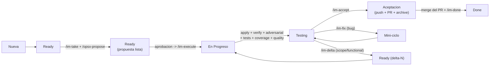

# IntermarkIt Dev Plugin

Plugin de Cursor para desarrolladores de IntermarkIt. Integra normas de trabajo siempre activas con workflow spec-driven (OpenSpec) sobre una **maquina de estados Jira de 6 posiciones** (`Nueva -> Ready -> En Progreso -> Testing -> Aceptacion -> Done`), con ciclos formales de `fix` y `delta` desde `Testing`, gate tecnico ampliado con tests + cobertura + quality + validacion local, y enrutamiento por lenguaje natural que reconoce intenciones sin necesidad de escribir el comando explicito.

Modelos fijados por rol: `claude-4.6-sonnet-medium-thinking` para desarrollo, `composer-2.5` para revision adversarial. Soporte multi-repo (frontend/backend/... en subcarpetas). Cache MCP local para ahorrar peticiones.

## Que incluye

- **Regla `intermarkit-global`** (`alwaysApply: true`) — fuente unica de verdad: cascada de setup, workflow con deltas, gate tecnico ampliado, convenciones Git, cache MCP, tabla de comandos y enrutamiento por lenguaje natural. Se carga en TODA conversacion sin invocar nada.
- **Agente `software-engineer`** — fijado a `claude-4.6-sonnet-medium-thinking`, sigue la regla global (no la duplica). Invocable con `/software-engineer` cuando se prefiera contexto aislado.
- **Subagente `adversarial-reviewer`** — fijado a `composer-2.5`. Revision esceptica y readonly tras cada implementacion, antes de archivar.
- **Skill `architect`** — documenta arquitectura y funcionalidad antes de implementar (brownfield o greenfield). Incluye las herramientas de tests, cobertura y quality gates del proyecto que consultan los pasos de `/im-execute`.
- **Skill `python-development`** — buenas practicas Python (uv, ruff, mypy, pytest) y frameworks estandar (FastAPI, Django, Typer, SQLAlchemy).
- **Multi-repo** — un proyecto puede tener uno o varios repositorios Git (frontend, backend, mobile...) en subcarpetas, configurados con `repos:` (lista) en vez de `repo:` (singular). Ver `config-template.yaml` y `rules/intermarkit-global.mdc §2.3bis`.
- **Comandos propios (v1.0+):**
  - `/im-take {ISSUE_KEY}` — arranca la tarea: rama + Jira a `Ready` + `/opsx-propose` + metricas. Espera aprobacion de la propuesta.
  - `/im-execute` — aprobacion → `En Progreso`: `apply` + `verify` + revision adversarial + tests + cobertura + quality gates. Al terminar, `Testing`.
  - `/im-fix` — bug detectado en Testing (spec correcta, codigo mal). Mini-ciclo sin sibling OpenSpec, mantiene Jira en `Testing`.
  - `/im-delta` — cambio de spec (scope o funcional) desde Testing. Crea sibling OpenSpec, vuelve a `Ready` con nueva propuesta.
  - `/im-accept` — usuario valida en local → `Aceptacion`: commit + push + PR + archive + marca criterios + comentario con metricas.
  - `/im-done` — tras merge del PR y confirmacion explicita → `Done`.
  - `/im-status` — resumen readonly del estado (tarea activa, gates, deltas, fixes, tokens, cache).
- **Enrutamiento por lenguaje natural** — el agente reconoce frases como "vi este error", "falta X", "adelante", "el PR se mergeo", etc. y las mapea al comando adecuado segun el estado Jira actual, sin necesidad de escribir el comando explicito. Reglas de desambigüacion en la regla global §10.
- **MCP Atlassian** (`mcp.json`) — servidor oficial `https://mcp.atlassian.com/v1/mcp/authv2`. Cubre Jira, Confluence y **Bitbucket Cloud** (PRs, branches, pipelines, repos).
- **Hook `sessionStart`** — inyecta contexto de proyecto + pre-checks (credentials, docs, openspec, tarea activa, estado cache MCP) al inicio de cada sesion. Evita 4-6 tool calls repetitivos.
- **Hook `postToolUse`** — incrementa `tool_calls` en la tarea activa. O(1) via pointer `.active`, con lock (`fcntl.flock`) para tool calls concurrentes.
- **Hook `stop`** — al final de cada turno del agente acumula tokens reales (`input`, `output`, `cache_read`, `cache_write`) y cuenta de turnos.
- **Hook `sessionEnd`** — al cerrarse la conversacion marca `finished_at`/`elapsed_ms`. NO borra el pointer `.active` — la tarea puede sobrevivir al cierre del chat.
- **Hook `preCompact`** — registra `context_peak` cada vez que Cursor compacta el contexto.
- **Hook `workflow-gate.sh`** — bloquea `git push` de la tarea activa hasta que TODOS los gates del bloque `verification` esten en verde (`verify_passed`, `adversarial_verdict == "APROBADO"`, `tests_passed`, `coverage_ok`, `quality_ok`, `archived`, `local_validation_passed`), salvo excepciones triviales (`exempt: true` con razon). Compat hacia atras con tareas creadas antes de v1.0.0.
- **Cache MCP local (`.intermarkit/cache/`)** — `atlassian-user.json` (30d), `jira-transitions-{PROJECT}.json` (7d), `bitbucket-verified.json` (24h).

## Como se activa

La regla `intermarkit-global` (`alwaysApply: true`) se carga automaticamente en **cada conversacion**. No hace falta escribir `/software-engineer` ni ningun comando. El agente y el subagente estan disponibles para invocacion explicita cuando se prefiera contexto aislado.

## Primera vez

La regla guia el setup automaticamente:

1. **Autentica MCP Atlassian** — si pide login OAuth, te guia para completarlo.
2. **Crea config global** (`~/.intermarkit/credentials.yaml`) — si no existe.
3. **Crea config de proyecto** (`.intermarkit/config.yaml`) — clave Jira y, segun el proyecto sea de un solo repo o multi-repo, URL/tipo/workspace de cada repositorio.
4. **Verifica OpenSpec** — si no esta inicializado, ofrece `openspec init --tools cursor`.
5. **Verifica Bitbucket** — comprueba `bitbucketWorkspace` (requiere que un admin habilite API token auth).
6. **Documenta arquitectura** (skill `architect`) — genera `.intermarkit/architecture.md` y `.intermarkit/functional.md`. **En v1.0+, `architecture.md` DEBE declarar las herramientas y umbrales** de tests unitarios, cobertura y quality gates (linter/formatter/type-checker); son los que consulta `/im-execute` para marcar `tests_passed`, `coverage_ok` y `quality_ok`.

No necesitas crear ficheros manualmente. El agente los genera. **Todo lo que ya esta OK, el hook `sessionStart` lo detecta y el agente lo salta**.

## Prerequisitos

1. **OpenSpec CLI**:
   ```bash
   npm install -g @fission-ai/openspec@latest
   ```
2. **Bitbucket Cloud** (para operaciones remotas: PRs, pipelines, branches via MCP):
   - El workspace de Bitbucket debe estar vinculado a la organizacion Atlassian.
   - Un admin debe habilitar **API token authentication** en: `Admin Hub > Rovo > Rovo MCP`.
   - Las operaciones Git locales (checkout, commit, push) funcionan sin este paso.
3. **Workflow Jira con seis estados** — el proyecto Jira necesita los estados `Nueva`, `Ready`, `En Progreso`, `Testing`, `Aceptacion` y `Done` (o equivalentes cuyos nombres emparejen tolerando espacios/acentos) con transiciones entre ellos. Configuracion fuera del alcance del plugin. Si alguna transicion no existe, el agente informa y sigue sin bloquear.

## Uso

Al ser normas siempre activas, puedes preguntar directamente sin invocar nada. El agente reconoce frases naturales (regla global §10).

### Consultar tareas

```
que tareas tengo?
```

### Trabajar en una tarea (workflow completo)

Puedes usar frases naturales o comandos:

```
trabaja en PROJ-42            # equivale a /im-take PROJ-42
adelante                       # con propuesta ya aprobada -> /im-execute
vi este error [descripcion]    # en Testing -> /im-fix
falta que tambien haga X       # en Testing -> /im-delta (scope)
prefiero que sea Y             # en Testing -> /im-delta (functional)
funciona                       # en Testing -> /im-accept
el PR se mergeo                # en Aceptacion -> /im-done
```

Comprobar estado en cualquier momento (readonly):

```
/im-status                     # o "como va", "estado", "resumen"
```

### Workflow por estado

Detallado en `rules/intermarkit-global.mdc §6.3` y `agents/software-engineer.md`.



**Fase `Ready`:** `/im-take` crea rama, mueve Jira a `Ready`, inicializa metricas y ejecuta `/opsx-propose`. Espera aprobacion explicita de la propuesta.

**Fase `En Progreso`:** `/im-execute` aplica, verifica, lanza revision adversarial, corre tests + cobertura + quality gates. Todo local, sin push. Al terminar, transiciona a `Testing`.

**Fase `Testing`:** el usuario prueba el feature en local. Tres salidas:
- `/im-accept` -> `Aceptacion` si todo funciona.
- `/im-fix` -> mini-ciclo sin sibling OpenSpec para bugs (spec no cambia).
- `/im-delta` -> nuevo sibling OpenSpec para cambios de scope o funcionales (spec cambia). Vuelve a `Ready`.

**Fase `Aceptacion`:** `/im-accept` marca la validacion local, hace commit + push + PR + archive OpenSpec + marca criterios Jira + comentario con metricas. La tarea sigue activa esperando el merge.

**Fase `Done`:** `/im-done` cierra la tarea tras confirmacion explicita del usuario de que el PR se ha mergeado.

## Gate tecnico

El hook `hooks/workflow-gate.sh` bloquea cualquier `git push` de la tarea activa hasta que TODOS los gates de `.intermarkit/task-metrics/{ISSUE_KEY}.json` esten en verde:

| Gate | Se marca en |
|---|---|
| `verify_passed` | `/im-execute` tras `/opsx-verify` OK |
| `adversarial_verdict == "APROBADO"` | `/im-execute` tras `adversarial-reviewer` APROBADO |
| `tests_passed` | `/im-execute` tras pasar suite de tests |
| `coverage_ok` | `/im-execute` tras cumplir umbral de cobertura |
| `quality_ok` | `/im-execute` tras pasar linter/formatter/type-checker |
| `archived` | `/im-execute` tras `/opsx-archive` OK |
| `local_validation_passed` | `/im-accept` tras confirmacion del usuario |

Excepciones (regla global §3): typos, deps menores, docs. Marcar `verification.exempt = true` con `exempt_reason` breve salta el gate por completo.

**Compat hacia atras:** tareas creadas antes de v1.0.0 solo tenian `verify_passed`, `adversarial_verdict`, `archived`. El hook trata los campos ausentes como `true` para no romper tareas en curso.

## Multi-repo (frontend, backend, mobile, ...)

Por defecto un proyecto tiene un unico repositorio (`repo:` en `config.yaml`, comportamiento sin cambios). Si el proyecto tiene varios repos en subcarpetas (ej: `./frontend`, `./backend`), usa `repos:` (lista):

```yaml
repos:
  - name: frontend
    path: frontend
    type: bitbucket
    url: https://bitbucket.org/intermarkithub/frontend-repo
    workspace: intermarkithub
    default_branch: main
  - name: backend
    path: backend
    type: bitbucket
    url: https://bitbucket.org/intermarkithub/backend-repo
    workspace: intermarkithub
    default_branch: main
```

Como funciona:

- **Al tomar una tarea (`/im-take`)** — si hay mas de un repo configurado, el agente pregunta cuales afectan a esa tarea. La respuesta se guarda en `.intermarkit/task-metrics/{ISSUE_KEY}.json` (`repos: ["frontend", "backend"]`) para no repetir la pregunta en fases posteriores.
- **Ramas** — misma convencion (`feature/PROJ-XXX-slug`) en cada repo seleccionado.
- **Al aceptar la tarea (`/im-accept`)** — commit + push independiente por repo (se omite el que no tuvo cambios) y un Pull Request por repo, cada uno contra su propio `workspace`/URL.
- **`/im-status`** — muestra la rama actual de cada repo configurado.

`repos:` y `repo:` son mutuamente excluyentes; si ambos existen en el fichero, `repos:` tiene prioridad. Un proyecto de un solo repo se comporta exactamente igual que antes de esta funcionalidad — no se pregunta nada.

## Ahorro de peticiones

Diseno explicito para reducir tokens y llamadas MCP:

- **Regla global unica** — el agente NO duplica la cascada; delega en la regla `intermarkit-global.mdc`.
- **Hook `sessionStart` con pre-checks** — devuelve `config_exists`, `credentials_global_exists`, `architecture_docs_exists`, `openspec_initialized`, `active_task` y estado de la cache MCP. El agente evita 4-6 tool calls al inicio de cada chat.
- **Cache MCP local** — `atlassianUserInfo` (30d), transiciones Jira por proyecto (7d), verificacion Bitbucket (24h). Ahorra 3-5 llamadas MCP por tarea completa.
- **Pointer `.active`** — los hooks pasan de O(n) (escaneando todos los JSON) a O(1) (leyendo un solo pointer).

Detalles del schema de cache y ejemplos: [`agents/reference.md`](agents/reference.md#cache-mcp-schema).

## Metricas de tarea

Cada tarea Jira genera `.intermarkit/task-metrics/{ISSUE_KEY}.json` con datos recolectados **automaticamente por los hooks del plugin** (sin trabajo del agente ni llamadas MCP):

| Metrica | Fuente | Fiable |
|---|---|---|
| Tool calls | Hook `postToolUse` (incremento en vivo) | Si |
| Tokens (input/output/cache_read/cache_write/turns) | Hook `stop` (payload real de Cursor v3.10.17+) | Si, cota inferior — el turno actual (el que escribe el comentario Jira) no esta contabilizado |
| Total de tokens (input + output) y coste estimado en € | Calculado por el agente al reportar, tabla de precios por modelo (`agents/reference.md §Total de tokens y coste estimado`) | Estimacion sobre tarifas de lista, no factura real — siempre con prefijo `≈` |
| Context peak | Hook `preCompact` | Solo si Cursor compacta el contexto al menos una vez |
| Tiempo dedicado | Agente en `/im-accept`: `started_at` vs `now` (por timestamp) | Si |
| Deltas archivados | `openspec_change` (lista) y `deltas[]` del fichero | Si |
| Fixes aplicados durante Testing | `fixes[]` del fichero | Si |

El comentario Jira de `/im-accept` refleja todas estas metricas cuando estan disponibles y las omite silenciosamente cuando no.

## Estructura

```
software-engineer-plugin/
├── .cursor-plugin/
│   └── plugin.json
├── agents/
│   ├── software-engineer.md
│   ├── adversarial-reviewer.md
│   └── reference.md            # bloques compartidos (MCP Bitbucket, cache schema, metrics, git conventions, plantillas)
├── skills/
│   ├── architect/
│   │   └── SKILL.md
│   └── python-development/
│       ├── SKILL.md
│       └── reference.md
├── rules/
│   └── intermarkit-global.mdc  # fuente unica de verdad
├── commands/
│   ├── im-take.md              # Ready
│   ├── im-execute.md           # En Progreso
│   ├── im-fix.md               # Testing loop (bug)
│   ├── im-delta.md             # Testing -> Ready (scope/functional)
│   ├── im-accept.md            # Aceptacion
│   ├── im-done.md              # Done
│   └── im-status.md
├── hooks/
│   ├── hooks.json
│   ├── session-context.sh          # sessionStart
│   ├── task-metrics-tooluse.sh     # postToolUse
│   ├── task-metrics-stop.sh        # stop
│   ├── task-metrics-session-end.sh # sessionEnd
│   ├── task-metrics-compact.sh     # preCompact
│   └── workflow-gate.sh            # beforeShellExecution, gate tecnico
├── scripts/
│   └── lint.sh                 # smoke checks del plugin
├── mcp.json
├── config-template.yaml
├── CHANGELOG.md
├── .gitignore
└── README.md
```

## Ficheros generados en cada proyecto consumidor

- `.intermarkit/config.yaml` — configuracion (commiteable, define el proyecto).
- `.intermarkit/architecture.md` — stack + arquitectura + herramientas/umbrales de tests/coverage/quality (commiteable, generado por la skill `architect`).
- `.intermarkit/functional.md` — documentacion funcional (commiteable).
- `.intermarkit/task-metrics/{ISSUE_KEY}.json` — metricas por tarea. Ver schema completo en [`agents/reference.md §Metricas de tarea`](agents/reference.md#metricas-de-tarea).
- `.intermarkit/task-metrics/.active` — pointer a tarea activa (local, NO commitear).
- `.intermarkit/task-metrics/.hooks.log` — log de errores de hooks (local, NO commitear).
- `.intermarkit/cache/*.json` — cache MCP local (local, NO commitear).

`.gitignore` recomendado para el proyecto consumidor:

```
.intermarkit/task-metrics/
.intermarkit/cache/
```

## Desarrollo del plugin

Smoke checks locales:

```bash
bash scripts/lint.sh
```

Valida JSON (`hooks/hooks.json`, `mcp.json`, `plugin.json`), YAML (`config-template.yaml`), sintaxis shell de los hooks (si `shellcheck` esta instalado) y que las rutas `command` declaradas en `hooks/hooks.json` existan y sean ejecutables.

## Licencia

MIT
